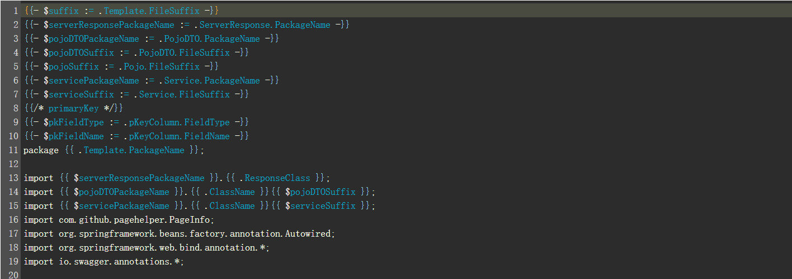

# code-generator

Language: [English](./README-en.md) | [中文简体](./README.md)

> A code generator based on GO language template developed by GO language

The core concept of the generator is to customize and manage templates, and use various template combinations to generate single table addition, deletion, modification, and query code in various languages

## Features
1. Developed with Vue+GO technology, supports cross-platform packaging and operation
2. The generator runs independently and does not depend on the project framework and development language
3. Cancel complex configuration file configuration generation rules in the project
4. Support custom template field and database column type development language type mapping
5. Support Excel import and export methods to manage and share template information within the team
6. Support the control of template when generating code, whether to generate and whether to rewrite
7. Support generated code package name (path) completely customized and interdependent
8. Use project template combination to generate single table addition, deletion, modification and query code for front and back ends

## Project preview

## 注意事项
1. The generator is based on the GO language template, and you need to understand the GO language template to write a template
2. The date format string of GO language is a specific character 2006-01-02 15:04:05
3. In the range loop of the GO language template, the template global variables cannot be obtained through .A, and need to be obtained by way of $.A

4. Templates rely on each other through template names, for example, A template gets the package name of B template

It is recommended that other template variables be introduced by defining variables at the top of the template
5. Interdependent templates need to be added and configured in the same project
6. The file name of the template generated code can be customized in the way of /xx/xxx.x
7. Currently, it only supports obtaining database tables of MySQL, Oracle and PostgreSQL. Since MySQL requires a root user to query keywords, ordinary users cannot use the keyword processing function
8. The project uses the Chrome browser to develop the page and other browsers are not adapted, so it is recommended to use the Chrome browser to open

## License
The code is distributed under the MIT license, please feel free to use the project in your proprietary software.
