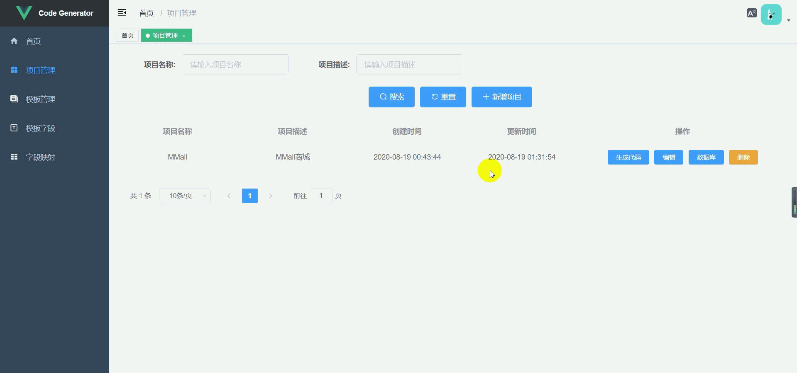
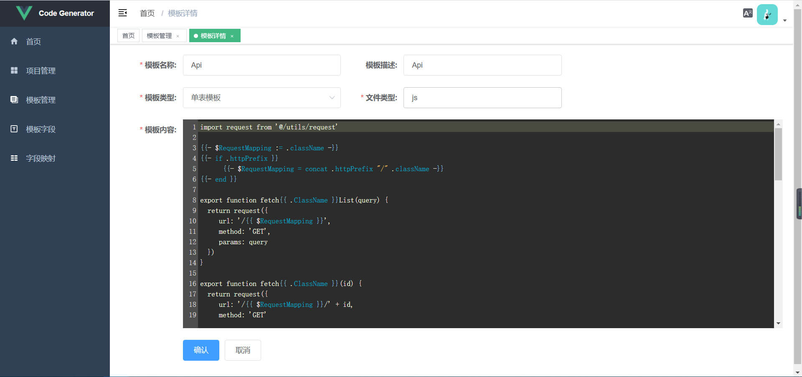
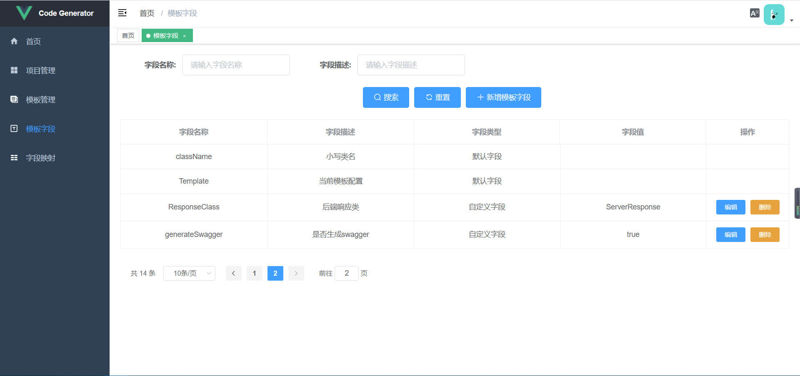
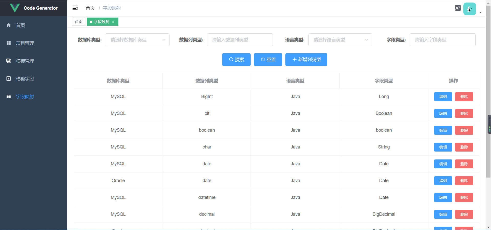
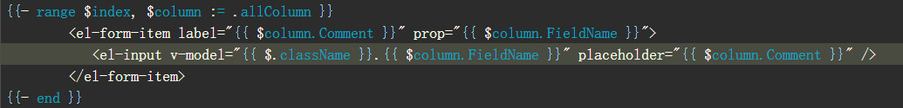
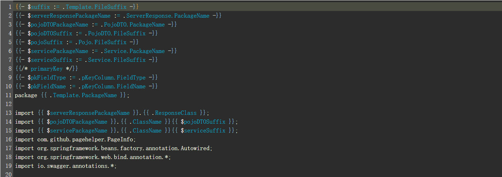

# code-generator

Language: [English](./README-en.md) | [中文简体](./README.md)

> 一个GO语言开发的基于GO语言模板的代码生成器

生成器的核心理念是对模板的定制和管理，利用各种模板组合生成各种语言的单表增删改查代码

## 特点
1. 采用Vue+GO技术开发，支持跨平台打包和运行
2. 生成器单独运行，不依赖项目框架和开发语言
3. 取消在项目中进行复杂的配置文件配置生成规则
4. 支持自定义模板字段和数据库列类型开发语言类型映射
5. 支持Excel导入和导出方式在团队内管理和分享模板信息
6. 支持生成代码时对模板的控制，是否生成和是否重写
7. 支持生成代码包名(路径)完全自定义和相互依赖
8. 利用项目模板组合生成前后端的单表增删改查代码

## 项目预览

## 注意事项
1. 生成器基于GO语言模板，编写模板需要了解GO语言模板
2. GO语言的日期格式化字符串为特定字符 2006-01-02 15:04:05
3. GO语言模板的range循环中无法通过 .A 获取模板全局变量，需要 $.A 的方式获取

4. 模板通过模板名称相互依赖，例如A模板获取B模板的包名

建议其他模板变量通过在模板最上面定义变量的方式引入
5. 相互依赖的模板需要都在同一项目中添加和配置
6. 模板生成代码的文件名可以 /xx/xxx.x 的方式自定义
7. 目前只支持获取MySQL、Oracle和PostgreSQL的数据库表，由于MySQL需要root用户才能查询关键字，因此普通用户无法使用关键字处理功能
8. 项目使用chrome浏览器开发页面其他浏览器未做适配，因此推荐使用chrome浏览器打开

## License

代码是根据MIT许可分发的，请随意在您的专有软件中使用项目
